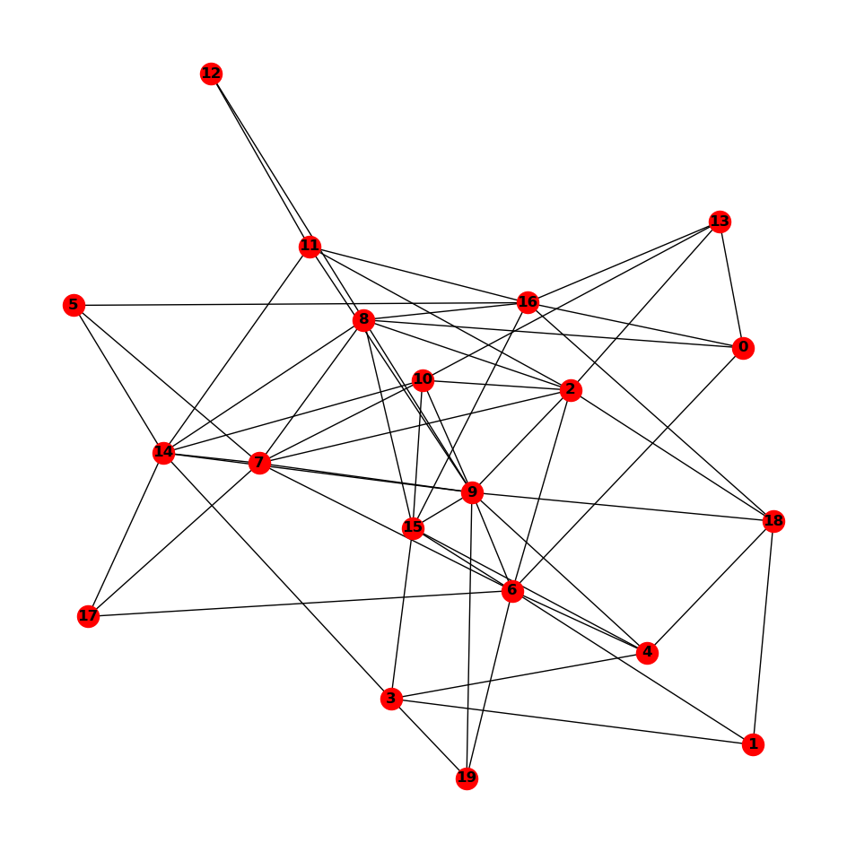
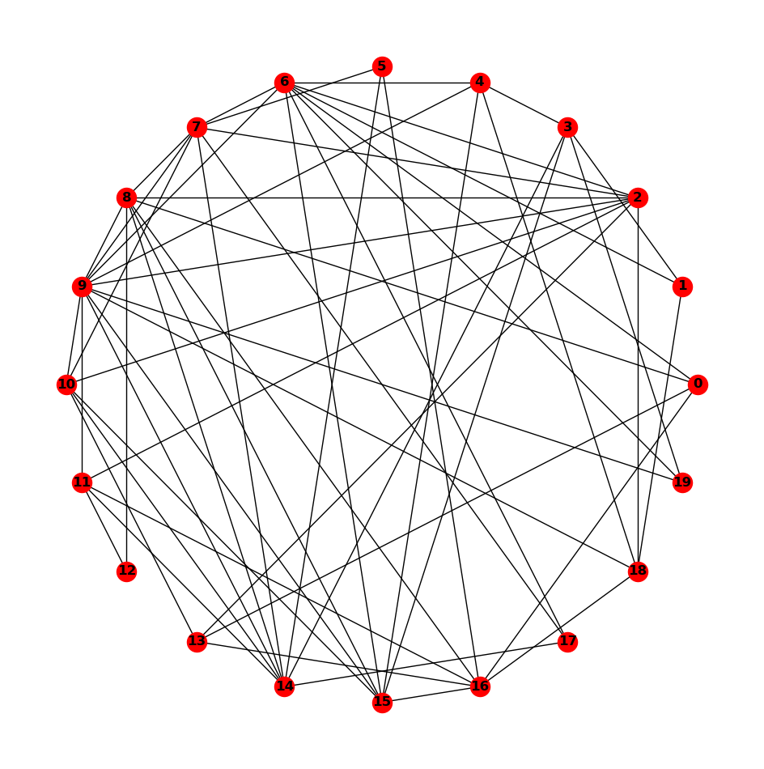
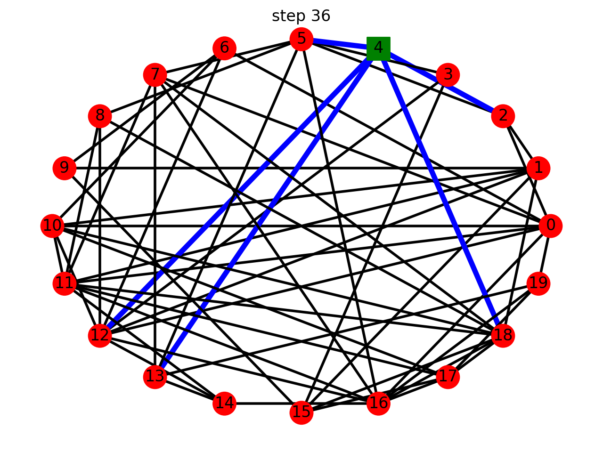
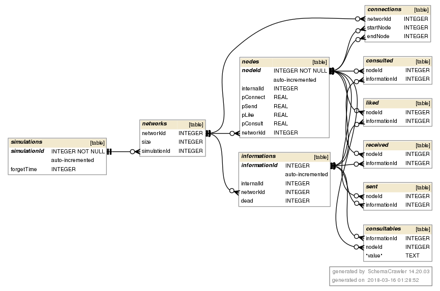

# Social Network dynamics simulation

## Program structure
This program is centered around 4 types of objects:
* _node_ object: which contains all info relevant to nodes of network (associated probabilities, neighbors, liked content, _etc..._)
* _information_ object: which contains the informations lifespan, its time before it's forgotten and whether or not it's readable by nodes
* _network_ object: contains nodes, informations that have been instantiated and display related attributes
* _simulation_ object: which allows a dynamic simulation of intra-network interactions through time.

## running the Program
To run the program simply execute the ___simulation.py___ file

## Network display
The network has 2 different ways of being displayed:
* spring layout, which positions nodes using Fruchterman-Reingold force-directed algorithm.
* shell layout, which positions nodes on concentric circles

Here are the two representations for the same network of 20 nodes  
the spring Layout :  
  
and the shell layout:  
  

There is an attribute to select the type of layout for network displaying.  

## Outputs
This program outputs two things:
* a static image of the network at the end of execution (in the selected layout)
* an animation of the network dynamic thanks to the _matplotlib.animate_ Python module.

The various events happening are displayed in the animation by this legend:
* if the node is square shaped it has consulted the received information for this time-step
* if the node is green it has liked the information it has received at the current time-step
* if the node is red and round it is in its default state
* if th edge between two nodes is blue, information is being sent along this axis (even though the graph is undirected it is easy to see which node is the sender since it sends the information to all its neighbors)
* if the edge is black, no information is flowing along it

Here is an example of one of the frames of the animation:  
  

Here we can see that node 4 has consulted and information, liked it and sent it to all it's neighbors (5, 2, 12, 13 and 18)  

The method to animate the simulation also takes the layout argument to choose which disposition you want to display the network with.  

## Saving networks
There is an option to save the results of the simulation to a local SQLite database. This database contains all relevant info regarding one run, and multiple runs can be stored in it.  
This database has the following structure:  

###author
Luc Blassel
